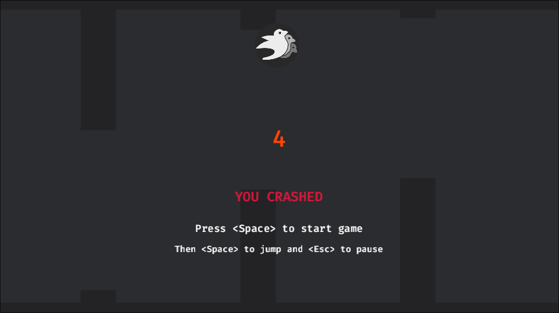

# Flappy Bevy

Flappy Bevy is a [Flappy Bird](https://en.wikipedia.org/wiki/Flappy_Bird) clone written in [Rust](https://www.rust-lang.org/) with [Bevy Engine](https://bevyengine.org/).

## Configuration

You can configure the game using the [Game.toml](Game.toml).

## Game architecture

The game architecture takes this approach:
- There is one root object -- `Game`, which create and run first-level components, resources, events, plugins and systems.
- All plugins form a hierarchy and are linked by events and components.
- All data is based on the hierarchy level it is required by.

The game is very small, but so far the idea of structuring code as a plugin hierarhy looks pretty neat.